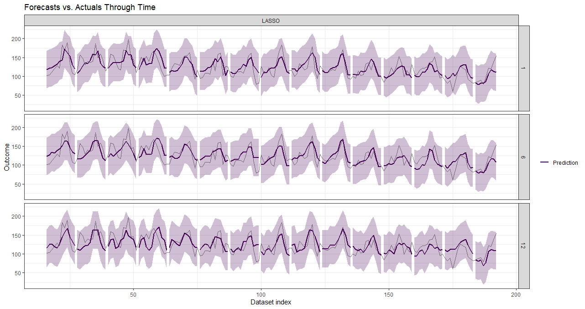
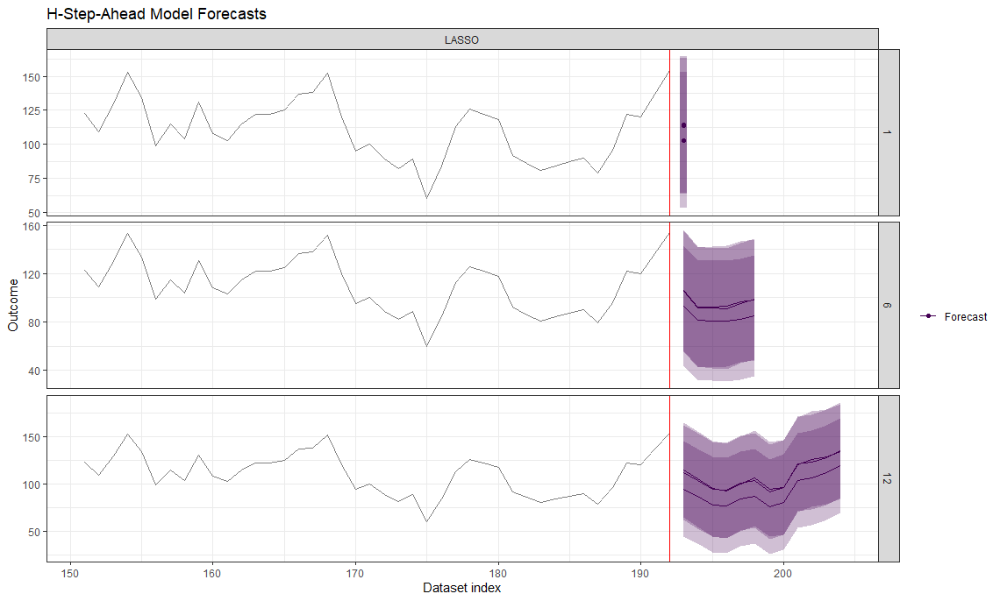

[](https://www.tidyverse.org/lifecycle/#maturing)
[](https://travis-ci.org/nredell/forecastML) 
[](https://codecov.io/github/nredell/forecastML)

# package::forecastML 

The purpose of `forecastML` is to provide a series of functions and visualizations that simplify the process of 
**multi-step-ahead direct forecasting with standard machine learning algorithms**. It's a wrapper package aimed at providing maximum flexibility in model-building--**choose any machine learning algorithm from any `R` package**--while helping the user quickly assess the (a) accuracy, (b) stability, and (c) generalizability of grouped (i.e., 
multiple related time-series) and ungrouped single-outcome forecasts produced from potentially high-dimensional modeling datasets.

This package is inspired by Bergmeir, Hyndman, and Koo's 2018 paper 
[A note on the validity of cross-validation for evaluating autoregressive time series prediction](https://doi.org/10.1016/j.csda.2017.11.003). 
In particular, `forecastML` makes use of 

* **lagged features**,
* **simple wrapper functions that support models from any `R` package**,
* **nested cross-validation** with (a) user-specified standard cross-validation in the inner loop and (b) block-contiguous validation 
datasets in the outer loop, and
* **parallel processing** with the `future` package 

to build and evaluate high-dimensional forecast models **without having to use methods that are time-series specific**. 

The following quote from Bergmeir et al.'s article nicely sums up the aim of this package:

> "When purely (non-linear, nonparametric) autoregressive methods are applied to forecasting problems, as is often the case
> (e.g., when using Machine Learning methods), the aforementioned problems of CV are largely
> irrelevant, and CV can and should be used without modification, as in the independent case."

## Install

``` r
devtools::install_github("nredell/forecastML")
library(forecastML)
```

* Setting the following `R` environment parameter may be needed to compile the vignettes.

``` r
base::Sys.setenv(LC_ALL="en_US.UTF-8")
```

## Vignettes

The main functions covered in each vignette are shown below as `function()`.

* Detailed **[forecastML overview vignette](https://nredell.github.io/forecastML/doc/package_overview.html)**. 
`create_lagged_df()`, `create_windows()`, `train_model()`, `return_error()`, `return_hyper()`

* **[Creating custom feature lags for model training](https://nredell.github.io/forecastML/doc/lagged_features.html)**. `create_lagged_df(lookback_control = ...)`

* **[Forecasting with multiple or grouped time-series](https://nredell.github.io/forecastML/doc/grouped_forecast.html)**. 
`fill_gaps()`, `create_lagged_df(dates = ..., groups = ..., static_features = ...)`, `create_windows()`, `train_model()`

## Cheat Sheet


## Key functions

1. **`fill_gaps`:** Optional if no temporal gaps/missing rows in data collection. Fill gaps in data collection and 
prepare a dataset of evenly-spaced time-series for modeling with lagged features. Returns a 'data.frame' with 
missing rows added in so that you can either (a) impute, remove, or ignore `NA`s prior to the `forecastML` pipeline 
or (b) impute, remove, or ignore them in the user-defined modeling function--depending on the `NA` handling 
capabilities of the user-specified model.

2. **`create_lagged_df`:** Create model training and forecasting datasets with lagged, grouped, and static features.

3. **`create_windows`:** Create time-contiguous validation datasets for model evaluation.

4. **`train_model`:** Train the user-defined model across forecast horizons and validation datasets.

5. **`return_error`:** Compute forecast error across forecast horizons and validation datasets.

6. **`return_hyper`:** Return user-defined model hyperparameters across validation datasets.

## FAQ

* **Q:** Where does `forecastML` fit in with respect to popular `R` machine learning packages like [mlr3](https://mlr3.mlr-org.com/) and [caret](https://github.com/topepo/caret)?
* **A:** The idea is that `forecastML` takes care of the tedious parts of forecasting with ML methods: creating training and forecasting datasets with different 
types of features--grouped, static, and dynamic--as well as simplifying validation dataset creation to assess model performance at specific points in time. 
That said, the workflow for packages like `mlr3` and `caret` would occur inside of the user-supplied 
modeling function which is passed into `forecastML::train_model()`. Examples of this type of 
modular workflow with these packages in particular are in the works.

## Example

Below is an example of how to create 12 horizon-specific ML models to forecast the number of `DriversKilled` 
12 time periods into the future using the `Seatbelts` dataset. Notice in the last plot that there are multiple forecasts; 
these are from the slightly different LASSO models trained in the nested cross-validation. An example of selecting optimal 
hyperparameters and retraining to create a single forecast model can be found in the overview vignette.

``` r
library(glmnet)
library(forecastML)

# Sampled Seatbelts data from the R package datasets.
data("data_seatbelts", package = "forecastML")

# Example - Training data for 12 horizon-specific models w/ common lags per feature. The data do 
# not have any missing rows or temporal gaps in data collection; if there were gaps, 
# we would need to use fill_gaps() first.
horizons <- 1:12  # 12 models that forecast 1, 1:2, 1:3, ..., and 1:12 time steps ahead.
lookback <- 1:15  # A lookback of 1 to 15 dataset rows (1 to )

#------------------------------------------------------------------------------
# Create a dataset of lagged features for modeling.
data_train <- forecastML::create_lagged_df(data_seatbelts, type = "train",
                                           outcome_cols = 1, lookback = lookback,
                                           horizon = horizons)

#------------------------------------------------------------------------------
# Create validation datasets for outer-loop nested cross-validation.
windows <- forecastML::create_windows(data_train, window_length = 12)

#------------------------------------------------------------------------------
# User-defined model function - LASSO
# The model_function() wrapper function takes 2 positional arguments. First, a data.frame 
# with a target and features with exactly the same format as
# returned by create_lagged_df(type = 'train'). Second, a column index of the target. The
# function returns a model object suitable for the user-defined predict function. The returned model 
# may also be a list that holds meta-data such as hyperparamter settings.

model_function <- function(data, outcome_cols = 1) {

  x <- data[, -(outcome_cols), drop = FALSE]
  y <- data[, outcome_cols, drop = FALSE]
  x <- as.matrix(x, ncol = ncol(x))
  y <- as.matrix(y, ncol = ncol(y))

  model <- glmnet::cv.glmnet(x, y)
  return(model)  # This model is the first argument in the user-defined predict() function below.
}

#------------------------------------------------------------------------------
# Train a model across forecast horizons and validation datasets.
model_results <- forecastML::train_model(data_train, windows,
                                         model_function, model_name = "LASSO")

#------------------------------------------------------------------------------
# User-defined prediction function - LASSO
# The predict() wrapper function takes 2 positional arguments. First,
# the returned model from the user-defined modeling function (model_function() above).
# Second, a data.frame of model features. If predicting on validation data, expect the input data to be 
# passed in the same format as returned by create_lagged_df(type = 'train') but with the outcome column 
# removed. If forecasting, expect the input data to be in the same format as returned by 
# create_lagged_df(type = 'forecast') but with the 'index' and 'horizon' columns removed. The function 
# can return a 1- or 3-column data.frame with either (a) point
# forecasts or (b) point forecasts plus lower and upper forecast bounds (column order and names do not matter).

prediction_function <- function(model, data_features) {

  x <- as.matrix(data_features, ncol = ncol(data_features))

  data_pred <- data.frame("y_pred" = predict(model, x, s = "lambda.min"),  # 1 column is required.
                          "y_pred_lower" = predict(model, x, s = "lambda.min") - 50,  # optional.
                          "y_pred_upper" = predict(model, x, s = "lambda.min") + 50)  # optional.
  return(data_pred)
}

# Predict on the validation datasets.
data_valid <- predict(model_results, prediction_function = list(prediction_function), data = data_train)

#------------------------------------------------------------------------------
# Plot forecasts for each validation dataset.
plot(data_valid, horizons = c(1, 6, 12))

#------------------------------------------------------------------------------
# Forecast.

# Forward-looking forecast data.frame.
data_forecast <- forecastML::create_lagged_df(data_seatbelts, type = "forecast",
                                              outcome_cols = 1,
                                              lookback = lookback, horizons = horizons)

# Forecasts.
data_forecasts <- predict(model_results, prediction_function = list(prediction_function),
                          data = data_forecast)

# We'll plot a background dataset of actuals as well.
plot(data_forecasts, data_actual = data_seatbelts[-(1:150), ], 
     actual_indices = as.numeric(row.names(data_seatbelts[-(1:150), ])), 
     horizons = c(1, 6, 12), windows = c(5, 10, 15))
```



***

## Roadmap

The following steps outline the functionality that I'd like to add leading up to an eventual 
CRAN release.

1. Thorough documentation including an `R` `pkgdown` site.

2. Thorough testing with `R` package `testthat`.
