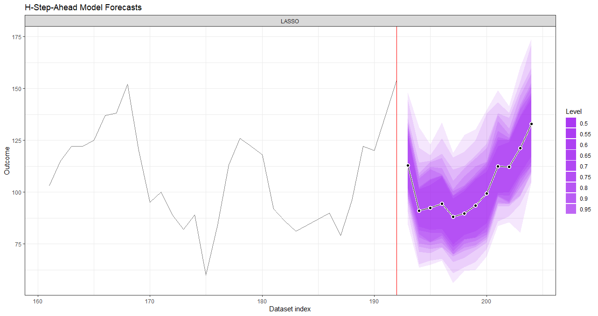
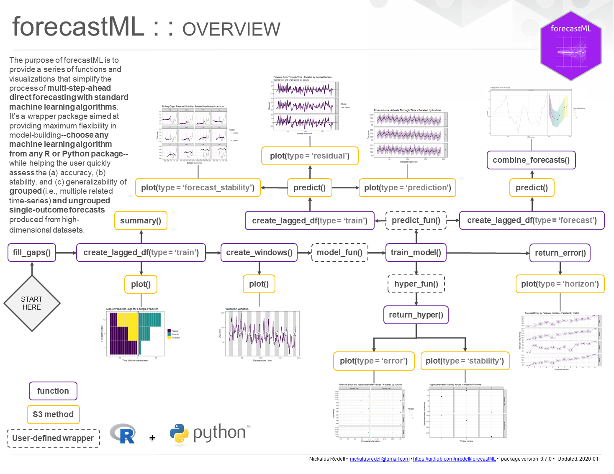
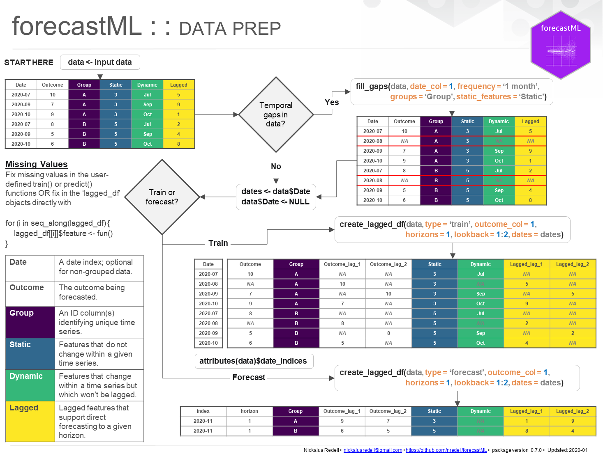
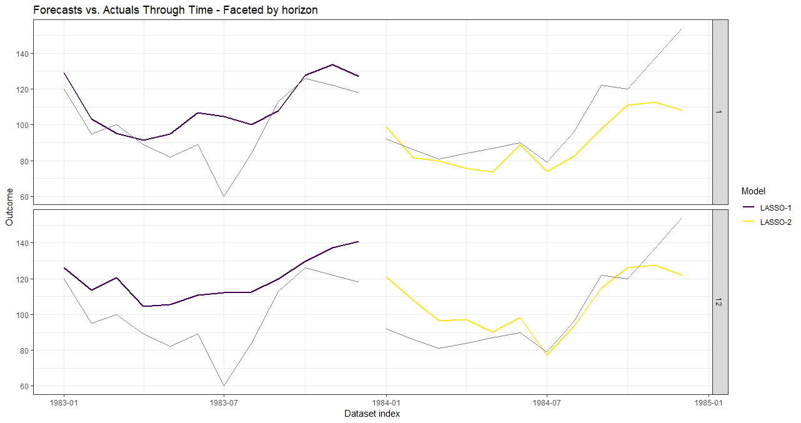
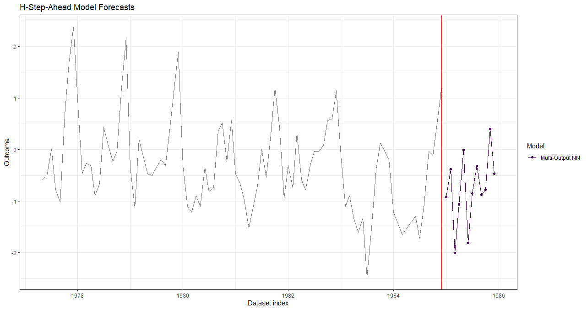
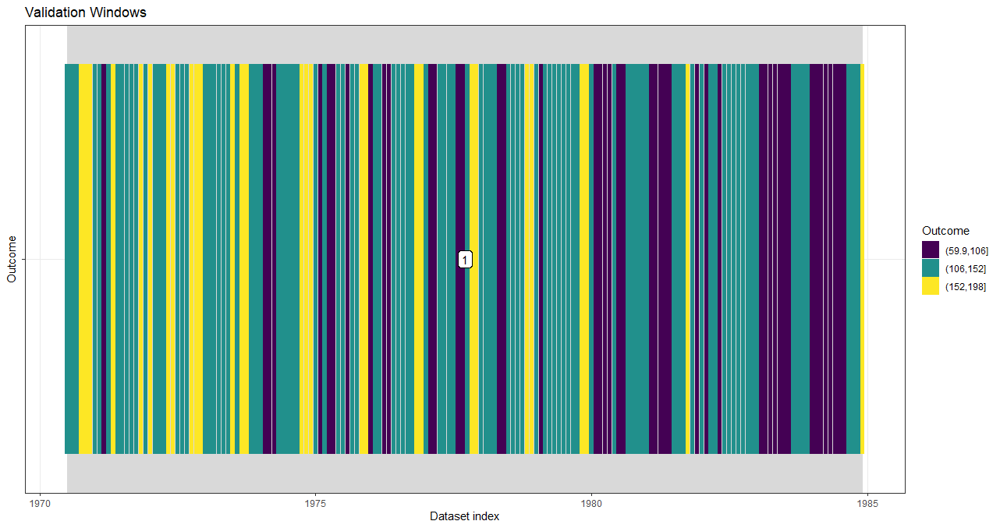
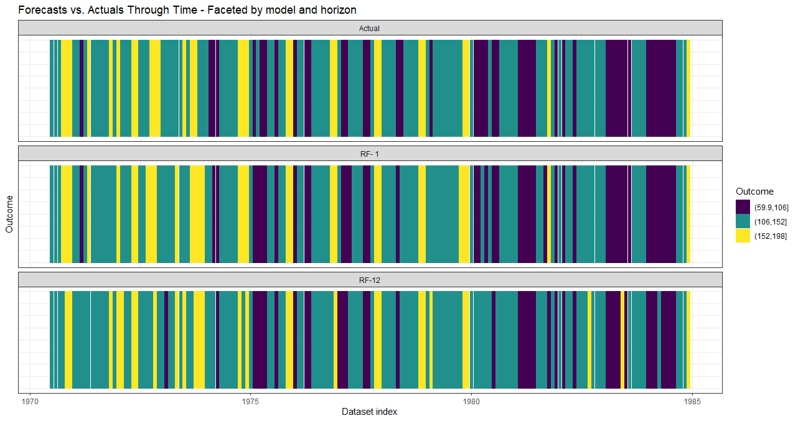
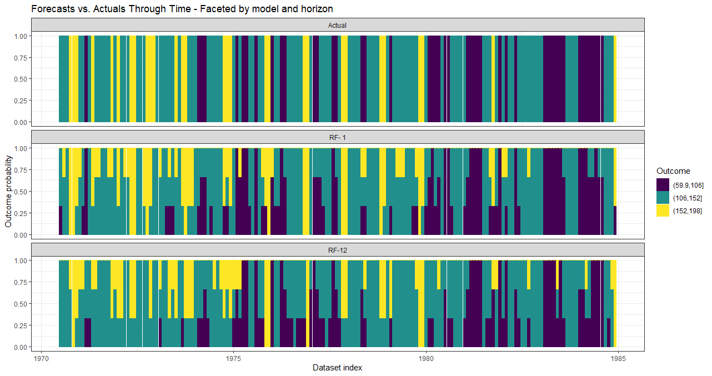
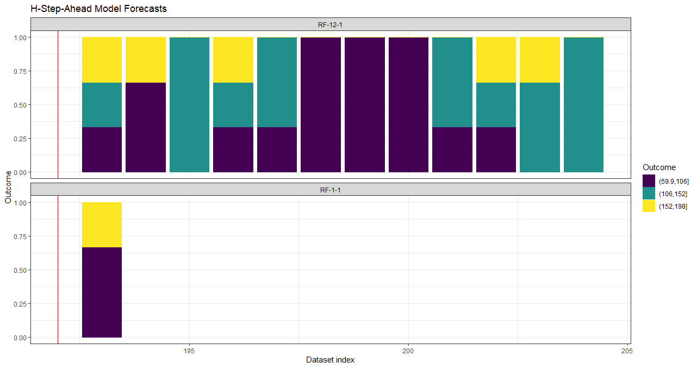

<p align="center">
  </img>
</p>

[](https://cran.r-project.org/package=forecastML)
[](https://www.tidyverse.org/lifecycle/#maturing)
[](https://travis-ci.org/nredell/forecastML) 
[](https://codecov.io/github/nredell/forecastML)
[](https://mybinder.org/v2/gh/nredell/forecastML/master?urlpath=https%3A%2F%2Fgithub.com%2Fnredell%2FforecastML%2Ftree%2Fmaster%2Fnotebooks%2F)

# package::forecastML 

The purpose of `forecastML` is to provide a series of functions and visualizations that simplify the process of 
**multi-step-ahead forecasting with standard machine learning algorithms**. It's a wrapper package aimed at providing maximum flexibility in model-building--**choose any machine learning algorithm from any `R` or `Python` package**--while helping the user quickly assess the (a) accuracy, (b) stability, and (c) generalizability of grouped (i.e., 
multiple related time series) and ungrouped forecasts produced from potentially high-dimensional modeling datasets.

This package is inspired by Bergmeir, Hyndman, and Koo's 2018 paper 
[A note on the validity of cross-validation for evaluating autoregressive time series prediction](https://doi.org/10.1016/j.csda.2017.11.003). 
which supports--under certain conditions--forecasting with high-dimensional ML models **without having to use methods that are time series specific**. 

The following quote from Bergmeir et al.'s article nicely sums up the aim of this package:

> "When purely (non-linear, nonparametric) autoregressive methods are applied to forecasting problems, as is often the case
> (e.g., when using Machine Learning methods), the aforementioned problems of CV are largely
> irrelevant, and CV can and should be used without modification, as in the independent case."

## Featured Notebooks

* **[Forecasting with big data - Spark and H2O](https://github.com/nredell/forecastML/blob/master/notebooks/Forecasting%20with%20big%20data%20-%20Spark%20and%20H2O.ipynb)**

* **[Forecasting with Python - scikit-learn in parallel](https://github.com/nredell/forecastML/blob/master/notebooks/python_sklearn_and_r_in_parallel/Forecasting%20with%20Python%20-%20scikit%20learn%20in%20parallel.ipynb)**

* **[Forecast reconciliation across planning horizons - coherent weekly ML and monthly ARIMA forecasts](https://github.com/nredell/forecastML/blob/master/notebooks/forecast_reconciliation/Forecast%20reconciliation%20across%20planning%20horizons%20-%20coherent%20weekly%20ML%20and%20monthly%20ARIMA%20forecasts.ipynb)**

User-contributed notebooks welcome!


## Lightning Example

* Requires `packageVersion("forecastML")` >= v0.9.1

``` r
library(glmnet)
library(forecastML)

data("data_seatbelts", package = "forecastML")

data_train <- forecastML::create_lagged_df(data_seatbelts, type = "train", method = "direct",
                                           outcome_col = 1, lookback = 1:15, horizons = 1:12)

windows <- forecastML::create_windows(data_train, window_length = 0)

model_fn <- function(data) {
  x <- as.matrix(data[, -1, drop = FALSE])
  y <- as.matrix(data[, 1, drop = FALSE])
  model <- glmnet::cv.glmnet(x, y)
}

model_results <- forecastML::train_model(data_train, windows, model_name = "LASSO", model_function = model_fn)

predict_fn <- function(model, data) {
  data_pred <- as.data.frame(predict(model, as.matrix(data)))
}

data_fit <- predict(model_results, prediction_function = list(predict_fn), data = data_train)

residuals <- residuals(data_fit)

data_forecast <- forecastML::create_lagged_df(data_seatbelts, type = "forecast", method = "direct",
                                              outcome_col = 1, lookback = 1:15, horizons = 1:12)

data_forecasts <- predict(model_results, prediction_function = list(predict_fn), data = data_forecast)

data_forecasts <- forecastML::combine_forecasts(data_forecasts)

set.seed(224)
data_forecasts <- forecastML::calculate_intervals(data_forecasts, residuals, 
                                                  levels = seq(.5, .95, .05), times = 200)

plot(data_forecasts, data_seatbelts[-(1:160), ], (1:nrow(data_seatbelts))[-(1:160)])
```


## README Contents

* **[Install](#install)**
* **[Approach to forecasting](#approach-to-forecasting)**
* **[Vignettes](#vignettes)**
* **[Cheat sheets](#cheat-sheets)**
* **[FAQ](#faq)**
* **Examples**
    + **[Forecasting numeric outcomes](#examples---numeric-outcomes-with-r-and-python)**
        + **[Direct forecasting](#direct-forecast-in-r)**
        + **[Multi-output forecasting](#multi-output-forecast-in-r)**
    + **[Forecasting factor outcomes (forecasting sequences)](#examples---factor-outcomes-with-r-and-python)**


## Install

* CRAN

``` r
install.packages("forecastML")
library(forecastML)
```

* Development

``` r
remotes::install_github("nredell/forecastML")
library(forecastML)
```


## Approach to Forecasting

### Direct forecasting

The direct forecasting approach used in `forecastML` involves the following steps:

**1.** Build a series of horizon-specific short-, medium-, and long-term forecast models.

**2.** Assess model generalization performance across a variety of heldout datasets through time.

**3.** Select those models that consistently performed the best at each forecast horizon and 
combine them to produce a single ensemble forecast.

* Below is a plot of 5 forecast models used to produce a single 12-step-ahead forecast where each color 
represents a distinct horizon-specific ML model. From left to right these models are:

* **1**: A feed-forward neural network (purple); **2**: An ensemble of ML models; 
**3**: A boosted tree model; **4**: A LASSO regression model; **5**: A LASSO regression model (yellow).


* Below is a similar combination of horizon-specific models with a factor outcome and forecasting factor 
probabilities 12 steps ahead.


### Multi-output forecasting

The multi-output forecasting approach used in `forecastML` involves the following steps:

**1.** Build a single multi-output model that simultaneously forecasts over both short- and long-term forecast horizons.

**2.** Assess model generalization performance across a variety of heldout datasets through time.

**3.** Select the hyperparamters that minimize forecast error over all the relevant forecast horizons and re-train.


## Vignettes

The main functions covered in each vignette are shown below as `function()`.

* Detailed **[forecastML overview vignette](https://nredell.github.io/forecastML/doc/package_overview.html)**. 
`create_lagged_df()`, `create_windows()`, `train_model()`, `return_error()`, `return_hyper()`, `combine_forecasts()`

* **[Creating custom feature lags for model training](https://nredell.github.io/forecastML/doc/lagged_features.html)**. `create_lagged_df(lookback_control = ...)`

* **[Direct Forecasting with multiple or grouped time series](https://nredell.github.io/forecastML/doc/grouped_forecast.html)**. 
`fill_gaps()`, 
`create_lagged_df(dates = ..., dynamic_features = ..., groups = ..., static_features = ...)`, `create_windows()`, `train_model()`, `combine_forecasts()`

* **[Direct Forecasting with multiple or grouped time series - Sequences](https://nredell.github.io/forecastML/doc/grouped_forecast_sequences.html)**. 
`fill_gaps()`, 
`create_lagged_df(dates = ..., dynamic_features = ..., groups = ..., static_features = ...)`, `create_windows()`, `train_model()`, `combine_forecasts()`

* **[Customizing the user-defined wrapper functions](https://nredell.github.io/forecastML/doc/custom_functions.html)**. 
`train()` and `predict()`

* **[Forecast combinations](https://nredell.github.io/forecastML/doc/combine_forecasts)**. `combine_forecasts()`


## Cheat Sheets



1. **`fill_gaps`:** Optional if no temporal gaps/missing rows in data collection. Fill gaps in data collection and 
prepare a dataset of evenly-spaced time series for modeling with lagged features. Returns a 'data.frame' with 
missing rows added in so that you can either (a) impute, remove, or ignore `NA`s prior to the `forecastML` pipeline 
or (b) impute, remove, or ignore them in the user-defined modeling function--depending on the `NA` handling 
capabilities of the user-specified model.

2. **`create_lagged_df`:** Create model training and forecasting datasets with lagged, grouped, dynamic, and static features.

3. **`create_windows`:** Create time-contiguous validation datasets for model evaluation.

4. **`train_model`:** Train the user-defined model across forecast horizons and validation datasets.

5. **`return_error`:** Compute forecast error across forecast horizons and validation datasets.

6. **`return_hyper`:** Return user-defined model hyperparameters across validation datasets.

7. **`combine_forecasts`:** Combine multiple horizon-specific forecast models to produce one forecast.



<br>


## FAQ

* **Q:** Where does `forecastML` fit in with respect to popular `R` machine learning packages like [mlr3](https://mlr3.mlr-org.com/) and [caret](https://github.com/topepo/caret)?
* **A:** The idea is that `forecastML` takes care of the tedious parts of forecasting with ML methods: creating training and forecasting datasets with different 
types of features--grouped, static, and dynamic--as well as simplifying validation dataset creation to assess model performance at specific points in time. 
That said, the workflow for packages like `mlr3` and `caret` would mostly occur inside of the user-supplied 
modeling function which is passed into `forecastML::train_model()`. Refer to the wrapper function customization 
vignette for more details.

* **Q:** How do I get the model training and forecasting datasets as well as the trained models out of the 
`forecastML` pipeline?
* **A:** After running `forecastML::create_lagged_df()` with either `type = "train"` or `type = "forecast"`, 
the `data.frame`s can be accessed with `my_lagged_df$horizon_h` where "h" is an integer marking the 
horizon-specific dataset (e.g., the value(s) passed in `horizons = ...`). The trained models from 
`forecastML::train_model()` can be accessed with `my_trained_model$horizon_h$window_w$model` where "w" is 
the validation window number from `forecastML::create_windows()`.


## Examples - Numeric Outcomes with R and Python

### Direct forecast in R

Below is an example of how to create 12 horizon-specific ML models to forecast the number of `DriversKilled` 
12 time periods into the future using the `Seatbelts` dataset. Notice in the last plot that there are multiple forecasts; 
these are from the slightly different LASSO models trained in the nested cross-validation. An example of selecting optimal 
hyperparameters and retraining to create a single forecast model (i.e., `create_windows(..., window_length = 0)`) can be found 
in the overview vignette.

``` r
library(glmnet)
library(forecastML)

# Sampled Seatbelts data from the R package datasets.
data("data_seatbelts", package = "forecastML")

# Example - Training data for 12 horizon-specific models w/ common lags per feature. The data do 
# not have any missing rows or temporal gaps in data collection; if there were gaps, 
# we would need to use fill_gaps() first.
horizons <- 1:12  # 12 models that forecast 1, 1:2, 1:3, ..., and 1:12 time steps ahead.
lookback <- 1:15  # A lookback of 1 to 15 dataset rows (1:15 * 'date frequency' if dates are given).

#------------------------------------------------------------------------------
# Create a dataset of lagged features for modeling.
data_train <- forecastML::create_lagged_df(data_seatbelts, type = "train",
                                           outcome_col = 1, lookback = lookback,
                                           horizon = horizons)

#------------------------------------------------------------------------------
# Create validation datasets for outer-loop nested cross-validation.
windows <- forecastML::create_windows(data_train, window_length = 12)

#------------------------------------------------------------------------------
# User-define model - LASSO
# A user-defined wrapper function for model training that takes the following
# arguments: (1) a horizon-specific data.frame made with create_lagged_df(..., type = "train")
# (e.g., my_lagged_df$horizon_h) and, optionally, (2) any number of additional named arguments
# which can also be passed in '...' in train_model(). The function returns a model object suitable for 
# the user-defined predict function. The returned model may also be a list that holds meta-data such 
# as hyperparameter settings.

model_function <- function(data, my_outcome_col) {  # my_outcome_col = 1 could be defined here.

  x <- data[, -(my_outcome_col), drop = FALSE]
  y <- data[, my_outcome_col, drop = FALSE]
  x <- as.matrix(x, ncol = ncol(x))
  y <- as.matrix(y, ncol = ncol(y))

  model <- glmnet::cv.glmnet(x, y)
  return(model)  # This model is the first argument in the user-defined predict() function below.
}

#------------------------------------------------------------------------------
# Train a model across forecast horizons and validation datasets.
# my_outcome_col = 1 is passed in ... but could have been defined in the user-defined model function.
model_results <- forecastML::train_model(data_train,
                                         windows = windows,
                                         model_name = "LASSO", 
                                         model_function = model_function,
                                         my_outcome_col = 1,  # ...
                                         use_future = FALSE)

#------------------------------------------------------------------------------
# User-defined prediction function - LASSO
# The predict() wrapper function takes 2 positional arguments. First,
# the returned model from the user-defined modeling function (model_function() above).
# Second, a data.frame of model features. If predicting on validation data, expect the input data to be 
# passed in the same format as returned by create_lagged_df(type = 'train') but with the outcome column 
# removed. If forecasting, expect the input data to be in the same format as returned by 
# create_lagged_df(type = 'forecast') but with the 'index' and 'horizon' columns removed. The function 
# can return a 1- or 3-column data.frame with either (a) point
# forecasts or (b) point forecasts plus lower and upper forecast bounds (column order and names do not matter).

prediction_function <- function(model, data_features) {

  x <- as.matrix(data_features, ncol = ncol(data_features))
  data_pred <- data.frame("y_pred" = predict(model, x, s = "lambda.min"),  # 1 column is required.
                          "y_pred_lower" = predict(model, x, s = "lambda.min") - 50,  # optional.
                          "y_pred_upper" = predict(model, x, s = "lambda.min") + 50)  # optional.
  return(data_pred)
}

# Predict on the validation datasets.
data_valid <- predict(model_results, prediction_function = list(prediction_function), data = data_train)

#------------------------------------------------------------------------------
# Plot forecasts for each validation dataset.
plot(data_valid, horizons = c(1, 6, 12))

#------------------------------------------------------------------------------
# Forecast.

# Forward-looking forecast data.frame.
data_forecast <- forecastML::create_lagged_df(data_seatbelts, type = "forecast",
                                              outcome_col = 1, lookback = lookback, horizons = horizons)

# Forecasts.
data_forecasts <- predict(model_results, prediction_function = list(prediction_function), data = data_forecast)

# We'll plot a background dataset of actuals as well.
plot(data_forecasts,
     data_actual = data_seatbelts[-(1:150), ], 
     actual_indices = as.numeric(row.names(data_seatbelts[-(1:150), ])), 
     horizons = c(1, 6, 12), windows = c(5, 10, 15))
```


***

### Direct forecast in R & Python

Now we'll look at an example similar to above. The main difference is that our user-defined modeling 
and prediction functions are now written in `Python`. Thanks to the [reticulate](https://github.com/rstudio/reticulate) 
`R` package, entire ML workflows already written in `Python` can be imported into `forecastML` with the 
simple addition of 2 lines of `R` code.

* The `reticulate::source_python()` function will run a .py file and import any objects into your `R` environment. As we'll 
see below, we'll only be importing library calls and functions to keep our `R` environment clean.

``` r
library(forecastML)
library(reticulate)  # Move Python objects in and out of R. See the reticulate package for setup info.

reticulate::source_python("modeling_script.py")  # Run a Python file and import objects into R.
```

<br>

* Below is a simple, slightly different `forecastML` setup for the seatbelt forecasting problem from the 
previous example.

``` r
data("data_seatbelts", package = "forecastML")

horizons <- c(1, 12)  # 2 models that forecast 1 and 1:12 time steps ahead.

# A lookback across select time steps in the past. Feature lags 1 through 9 will be silently dropped from the 12-step-ahead model.
lookback <- c(1, 3, 6, 9, 12, 15)

date_frequency <- "1 month"  # Time step frequency.

# The date indices, which don't come with the stock dataset, should not be included in the modeling data.frame.
dates <- seq(as.Date("1969-01-01"), as.Date("1984-12-01"), by = date_frequency)

# Create a dataset of features for modeling.
data_train <- forecastML::create_lagged_df(data_seatbelts, type = "train", outcome_col = 1,
                                           lookback = lookback, horizon = horizons,
                                           dates = dates, frequency = date_frequency)

# Create 2 custom validation datasets for outer-loop nested cross-validation. The purpose of
# the multiple validation windows is to assess expected forecast accuracy for specific
# time periods while supporting an investigation of the hyperparameter stability for
# models trained on different time periods. Validation windows can overlap.
window_start <- c(as.Date("1983-01-01"), as.Date("1984-01-01"))
window_stop <- c(as.Date("1983-12-01"), as.Date("1984-12-01"))

windows <- forecastML::create_windows(data_train, window_start = window_start, window_stop = window_stop)
```

<br>

#### modeling_script.py

* Let's look at the content of our `Python` modeling file that we source()'d above. The `Python` wrapper function inputs 
and returns for `py_model_function()` and `py_prediction_function()` are the same as their `R` counterparts. Just 
be sure to expect and return `pandas` `DataFrame`s as conversion from `numpy` arrays has not been tested.

``` python

import pandas as pd
from sklearn import linear_model
from sklearn.preprocessing import StandardScaler

# User-defined model.
# A user-defined wrapper function for model training that takes the following
# arguments: (1) a horizon-specific pandas DataFrame made with create_lagged_df(..., type = "train")
# (e.g., my_lagged_df$horizon_h)
def py_model_function(data):
  
  X = data.iloc[:, 1:]
  y = data.iloc[:, 0]
  
  scaler = StandardScaler()
  X = scaler.fit_transform(X)
  
  model_lasso = linear_model.Lasso(alpha = 0.1)
  
  model_lasso.fit(X = X, y = y)
  
  return({'model': model_lasso, 'scaler': scaler})

# User-defined prediction function.
# The predict() wrapper function takes 2 positional arguments. First,
# the returned model from the user-defined modeling function (py_model_function() above).
# Second, a pandas DataFrame of model features. For numeric outcomes, the function 
# can return a 1- or 3-column pandas DataFrame with either (a) point
# forecasts or (b) point forecasts plus lower and upper forecast bounds (column order and names do not matter).
def py_prediction_function(model_list, data_x):
  
  data_x = model_list['scaler'].transform(data_x)
  
  data_pred = pd.DataFrame({'y_pred': model_list['model'].predict(data_x)})
  
  return(data_pred)
```

<br>

* Train and predict on historical validation data with the imported `Python` wrapper functions.

``` r
# Train a model across forecast horizons and validation datasets.
model_results <- forecastML::train_model(data_train,
                                         windows = windows,
                                         model_name = "LASSO",
                                         model_function = py_model_function,
                                         use_future = FALSE)

# Predict on the validation datasets.
data_valid <- predict(model_results, prediction_function = list(py_prediction_function), data = data_train)

# Plot forecasts for each validation dataset.
plot(data_valid, horizons = c(1, 12))
```


<br>

* Forecast with the same imported `Python` wrapper functions. The final wrapper functions may eventually have 
fixed hyperparameters or complicated model ensembles based on repeated model training and investigation.

``` r
# Forward-looking forecast data.frame.
data_forecast <- forecastML::create_lagged_df(data_seatbelts, type = "forecast", outcome_col = 1,
                                              lookback = lookback, horizon = horizons,
                                              dates = dates, frequency = date_frequency)

# Forecasts.
data_forecasts <- predict(model_results, prediction_function = list(py_prediction_function),
                          data = data_forecast)

# We'll plot a background dataset of actuals as well.
plot(data_forecasts, data_actual = data_seatbelts[-(1:150), ], 
     actual_indices = dates[-(1:150)], horizons = c(1, 12))
```


***

### Multi-output forecast in R

* This is the same seatbelt dataset example except now, instead of 1 model for each 
forecast horizon, we'll build 1 multi-output neural network model that forecasts 12 
steps into the future.

* Given that this is a small dataset, the multi-output approach would require a decent 
amount of tuning to produce accurate results. An alternative would be to forecast, say, 
horizons 6 through 12 if longer term forecasts were of interest to reduce the number of 
parameters; the output neurons do not have to start at a horizon of 1 or even be contiguous.

``` r
library(forecastML)
library(keras)  # Using the TensorFlow 2.0 backend.

data("data_seatbelts", package = "forecastML")

data_seatbelts[] <- lapply(data_seatbelts, function(x) {
  (x - mean(x, na.rm = TRUE)) / sd(x, na.rm = TRUE)
})

date_frequency <- "1 month"
dates <- seq(as.Date("1969-01-01"), as.Date("1984-12-01"), by = date_frequency)

data_train <- forecastML::create_lagged_df(data_seatbelts, type = "train", method = "multi_output",
                                           outcome_col = 1, lookback = 1:15, horizons = 1:12,
                                           dates = dates, frequency = date_frequency,
                                           dynamic_features = "law")

# 'window_length = 0' creates 1 historical training dataset with no external validation datasets. 
# Set it to, say, 24 to see the model and forecast stability when trained across different slices 
# of historical data.
windows <- forecastML::create_windows(data_train, window_length = 0)

#------------------------------------------------------------------------------
# 'data_y' consists of 1 column for each forecast horizon--here, 12.
model_fun <- function(data, horizons) {  # 'horizons' is passed in train_model().

  data_x <- apply(as.matrix(data[, -(1:length(horizons))]), 2, function(x){ifelse(is.na(x), 0, x)})
  data_y <- apply(as.matrix(data[, 1:length(horizons)]), 2, function(x){ifelse(is.na(x), 0, x)})

  layers_x_input <- keras::layer_input(shape = ncol(data_x))

  layers_x_output <- layers_x_input %>%
    keras::layer_dense(ncol(data_x), activation = "relu") %>%
    keras::layer_dense(ncol(data_x), activation = "relu") %>%
    keras::layer_dense(length(horizons))

  model <- keras::keras_model(inputs = layers_x_input, outputs = layers_x_output) %>%
    keras::compile(optimizer = 'adam', loss = 'mean_absolute_error')

  early_stopping <- callback_early_stopping(monitor = 'val_loss', patience = 2)

  tensorflow::tf$random$set_seed(224)

  model_results <- model %>%
    keras::fit(x = list(as.matrix(data_x)), y = list(as.matrix(data_y)),
               validation_split = 0.2, callbacks = c(early_stopping), verbose = FALSE)

  return(list("model" = model, "model_results" = model_results))
}
#------------------------------------------------------------------------------
# The predict() wrapper function will return a data.frame with a number of columns 
# equaling the number of forecast horizons.
prediction_fun <- function(model, data_features) {

  data_features[] <- lapply(data_features, function(x){ifelse(is.na(x), 0, x)})
  data_features <- list(as.matrix(data_features, ncol = ncol(data_features)))

  data_pred <- data.frame(predict(model$model, data_features))
  names(data_pred) <- paste0("y_pred_", 1:ncol(data_pred))

  return(data_pred)
}
#------------------------------------------------------------------------------

model_results <- forecastML::train_model(data_train, windows, model_name = "Multi-Output NN",
                                         model_function = model_fun,
                                         horizons = 1:12)

data_valid <- predict(model_results, prediction_function = list(prediction_fun), data = data_train)

# We'll plot select forecast horizons to reduce visual clutter.
plot(data_valid, facet = ~ model, horizons = c(1, 3, 6, 12))
```


* Forecast combinations from `combine_forecasts()` aren't necessary as we've trained only 1 model.

``` r
data_forecast <- forecastML::create_lagged_df(data_seatbelts, type = "forecast", method = "multi_output",
                                              outcome_col = 1, lookback = 1:15, horizons = 1:12,
                                              dates = dates, frequency = date_frequency,
                                              dynamic_features = "law")

data_forecasts <- predict(model_results, prediction_function = list(prediction_fun), data = data_forecast)

plot(data_forecasts, facet = NULL, data_actual = data_seatbelts[-(1:100), ], actual_indices = dates[-(1:100)])
```



## Examples - Factor Outcomes with R and Python

### R

* This example is similar to the numeric outcome examples with the exception that the outcome has been 
factorized to illustrate how factors or sequences are forecasted.

``` r
data("data_seatbelts", package = "forecastML")

# Create an artifical factor outcome for illustration' sake.
data_seatbelts$DriversKilled <- cut(data_seatbelts$DriversKilled, 3)

horizons <- c(1, 12)  # 2 models that forecast 1 and 1:12 time steps ahead.

# A lookback across select time steps in the past. Feature lag 1 will be silently dropped from the 12-step-ahead model.
lookback <- c(1, 12, 18)

date_frequency <- "1 month"  # Time step frequency.

# The date indices, which don't come with the stock dataset, should not be included in the modeling data.frame.
dates <- seq(as.Date("1969-01-01"), as.Date("1984-12-01"), by = date_frequency)

# Create a dataset of features for modeling.
data_train <- forecastML::create_lagged_df(data_seatbelts, type = "train", outcome_col = 1,
                                           lookback = lookback, horizon = horizons,
                                           dates = dates, frequency = date_frequency)

# We won't use nested cross-validation; rather, we'll train a model over the entire training dataset.
windows <- forecastML::create_windows(data_train, window_length = 0)

# This is the model-training dataset.
plot(windows, data_train)
```



* Model training and historical fit.

``` r
model_function <- function(data, my_outcome_col) {  # my_outcome_col = 1 could be defined here.
  
  outcome_names <- names(data)[1]
  model_formula <- formula(paste0(outcome_names,  "~ ."))
  
  set.seed(224)
  model <- randomForest::randomForest(formula = model_formula, data = data, ntree = 3)
  return(model)  # This model is the first argument in the user-defined predict() function below.
}

#------------------------------------------------------------------------------
# Train a model across forecast horizons and validation datasets.
# my_outcome_col = 1 is passed in ... but could have been defined in the user-defined model function.
model_results <- forecastML::train_model(data_train,
                                         windows = windows,
                                         model_name = "RF", 
                                         model_function = model_function,
                                         my_outcome_col = 1,  # ...
                                         use_future = FALSE)

#------------------------------------------------------------------------------
# User-defined prediction function.
#
# The predict() wrapper function takes 2 positional arguments. First,
# the returned model from the user-defined modeling function (model_function() above).
# Second, a data.frame of model features. If predicting on validation data, expect the input data to be 
# passed in the same format as returned by create_lagged_df(type = 'train') but with the outcome column 
# removed. If forecasting, expect the input data to be in the same format as returned by 
# create_lagged_df(type = 'forecast') but with the 'index' and 'horizon' columns removed.
# 
# For factor outcomes, the function can return either (a) a 1-column data.frame with factor level 
# predictions or (b) an L-column data.frame of predicted class probabilities where 'L' equals the 
# number of levels in the outcome; the order of the return()'d columns should match the order of the 
# outcome factor levels from left to right which is the default behavior of most predict() functions.

# Predict/forecast a single factor level.
prediction_function_level <- function(model, data_features) {
  
  data_pred <- data.frame("y_pred" = predict(model, data_features, type = "response"))
  
  return(data_pred)
}

# Predict/forecast outcome class probabilities.
prediction_function_prob <- function(model, data_features) {
  
  data_pred <- data.frame("y_pred" = predict(model, data_features, type = "prob"))
  
  return(data_pred)
}

# Predict on the validation datasets.
data_valid_level <- predict(model_results, 
                            prediction_function = list(prediction_function_level), 
                            data = data_train)
data_valid_prob <- predict(model_results, 
                           prediction_function = list(prediction_function_prob), 
                           data = data_train)

```

* Predict historical factor levels.

* With `window_length = 0` these are essentially plots of model fit.

``` r
plot(data_valid_level, horizons = c(1, 12))
```



* Predict historical class probabilities.

``` r
plot(data_valid_prob, horizons = c(1, 12))
```



* Forecast

``` r
# Forward-looking forecast data.frame.
data_forecast <- forecastML::create_lagged_df(data_seatbelts, type = "forecast",
                                              outcome_col = 1, lookback = lookback, horizons = horizons)

# Forecasts.
data_forecasts_level <- predict(model_results,
                                prediction_function = list(prediction_function_level),
                                data = data_forecast)

data_forecasts_prob <- predict(model_results,
                                prediction_function = list(prediction_function_prob),
                                data = data_forecast)
```

* Forecast factor levels

``` r
plot(data_forecasts_level)
```


* Forecast class probabilities

``` r
plot(data_forecasts_prob)
```


